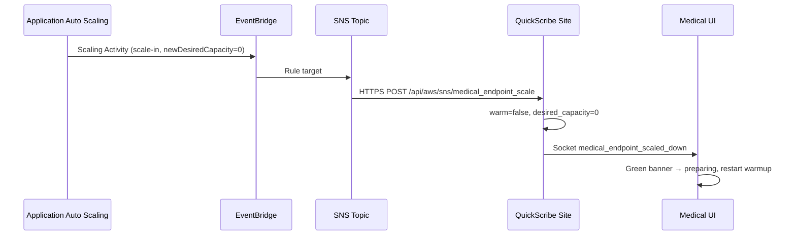

# Medical SageMaker capacity → Site webhook (EventBridge)

The medical UI should match **real endpoint capacity** (Application Auto Scaling), not inferred CPU gaps.

**Preferred path:** Application Auto Scaling scaling activity → **EventBridge** → **SNS** → HTTPS webhook → Site sets `endpoint warm=false` when `newDesiredCapacity` is **0**.

**Warm again** only after session warmup completes (`/api/gpu_started` or S3 async output) → `endpoint warm=true`.

## Flow



Scale-out (`0 → 1`) is also recorded (`desired_capacity=1`, `warm=false`) so status reflects “instances exist but not warmed yet.”

## Prerequisites

- Site deployed with `/api/aws/sns/medical_endpoint_scale`
- `PUBLIC_BASE_URL` reachable from AWS (SNS HTTPS)
- AWS CLI/credentials with **infra permissions** (not `QuickScribe_Koyeb_Uploader` — that user is S3-only)
- SageMaker endpoint autoscaling registered for your variant

## 1. Site / Koyeb environment

```env
PUBLIC_BASE_URL=https://www.getquickscribe.com
MEDICAL_WARMUP_SNS_TOPIC_ARN=arn:aws:sns:eu-north-1:ACCOUNT:quickscribe-medical-warmup-scale
SAGEMAKER_MEDICAL_ENDPOINT_NAME=quickscribe-transcribe-async
MEDICAL_SAGEMAKER_VARIANT_NAME=AllTraffic
```

**Global endpoint state** (one S3 file, shared by all doctors):

- `users/_global/medical_sagemaker_endpoint_scale.json` — `warm`, `desired_capacity`, `warmup_job_id`, etc.
- Poll: `GET /api/medical_endpoint_status` (optional `userId`; same JSON for every doctor).
- Green banner: `endpoint_ready === true` (warm and capacity &gt; 0).
- Per-user `_session_warmup_status.json` is no longer written.

Optional legacy CPU CloudWatch alarm on the same topic:

```env
MEDICAL_WARMUP_ALLOW_CLOUDWATCH_ALARM=true
MEDICAL_SCALE_IN_ALARM_NAME=quickscribe-medical-scale-in
```

## 2. Event pattern file

Edit `docs/aws/eventbridge-medical-autoscaling.json` so `resourceId` matches your endpoint and variant:

```text
endpoint/<ENDPOINT_NAME>/variant/<VARIANT_NAME>
```

Discover variant:

```powershell
aws sagemaker describe-endpoint --endpoint-name quickscribe-transcribe-async --region eu-north-1 `
  --query "ProductionVariants[0].VariantName" --output text
```

## 3. AWS CLI setup (PowerShell)

Use an **admin / infra** profile:

```powershell
aws sts get-caller-identity   # must NOT be QuickScribe_Koyeb_Uploader

$env:AWS_REGION = "eu-north-1"
$env:ENDPOINT_NAME = "quickscribe-transcribe-async"
$env:VARIANT_NAME = "AllTraffic"   # from describe-endpoint
$env:SITE_URL = "https://www.getquickscribe.com"
$env:TOPIC_NAME = "quickscribe-medical-warmup-scale"
$env:EB_RULE_NAME = "quickscribe-medical-autoscaling"
$env:SCALABLE_RESOURCE_ID = "endpoint/$($env:ENDPOINT_NAME)/variant/$($env:VARIANT_NAME)"

# Patch event pattern resourceId (or edit the JSON file under docs/aws/)
$patternPath = "C:\Work\QuickScribe\Site\docs\aws\eventbridge-medical-autoscaling.json"
$pattern = Get-Content $patternPath -Raw | ConvertFrom-Json
$pattern.detail.resourceId = @($env:SCALABLE_RESOURCE_ID)
$pattern | ConvertTo-Json -Depth 6 -Compress | Set-Content $patternPath -Encoding utf8
```

### 3a. SNS topic

```powershell
$TOPIC_ARN = aws sns create-topic --name $env:TOPIC_NAME --region $env:AWS_REGION `
  --query "TopicArn" --output text
Write-Host "TOPIC_ARN=$TOPIC_ARN"
```

### 3b. HTTPS subscription (Site auto-confirms SubscribeURL)

```powershell
aws sns subscribe --topic-arn $TOPIC_ARN --protocol https `
  --notification-endpoint "$($env:SITE_URL)/api/aws/sns/medical_endpoint_scale" `
  --region $env:AWS_REGION

Start-Sleep -Seconds 30
aws sns list-subscriptions-by-topic --topic-arn $TOPIC_ARN --region $env:AWS_REGION --output table
```

Subscription must show **Confirmed** (deploy Site first if still Pending).

### 3c. EventBridge rule → SNS

```powershell
aws events put-rule `
  --name $env:EB_RULE_NAME `
  --description "Medical SageMaker variant capacity changes" `
  --event-pattern file://$patternPath `
  --state ENABLED `
  --region $env:AWS_REGION

aws events put-targets `
  --rule $env:EB_RULE_NAME `
  --region $env:AWS_REGION `
  --targets "Id=MedicalWarmupSns","Arn=$TOPIC_ARN"
```

`put-targets` adds the SNS publish permission on the topic automatically.

### 3d. Verify rule

```powershell
aws events describe-rule --name $env:EB_RULE_NAME --region $env:AWS_REGION
aws events list-targets-by-rule --rule $env:EB_RULE_NAME --region $env:AWS_REGION
```

## 4. Test scale-in (real capacity change)

Trigger autoscaling scale-in (adjust your policy / cooldown as you debug), or temporarily set min=0 and wait for scale-in:

```powershell
# Example: inspect recent scaling activities
aws application-autoscaling describe-scaling-activities `
  --service-namespace sagemaker `
  --resource-id $env:SCALABLE_RESOURCE_ID `
  --region $env:AWS_REGION `
  --max-results 5 `
  --output table
```

When a **Successful** scale-in sets capacity to **0**, within seconds you should see:

- Site log: `EventBridge scale-in capacity=0`
- Site log: `medical_endpoint_scaled_down emitted`
- UI: green “מוכנה” → yellow preparing

Scale-out (`newDesiredCapacity >= 1`) logs `EventBridge scale-out` but stays **not warm** until warmup finishes.

## 5. Bash (same steps)

```bash
export AWS_REGION=eu-north-1
export ENDPOINT_NAME=quickscribe-transcribe-async
export VARIANT_NAME=AllTraffic
export SITE_URL=https://www.getquickscribe.com
export TOPIC_NAME=quickscribe-medical-warmup-scale
export EB_RULE_NAME=quickscribe-medical-autoscaling
export SCALABLE_RESOURCE_ID="endpoint/${ENDPOINT_NAME}/variant/${VARIANT_NAME}"

# Edit docs/aws/eventbridge-medical-autoscaling.json resourceId to match SCALABLE_RESOURCE_ID

TOPIC_ARN=$(aws sns create-topic --name "$TOPIC_NAME" --region "$AWS_REGION" --query TopicArn --output text)

aws sns subscribe --topic-arn "$TOPIC_ARN" --protocol https \
  --notification-endpoint "${SITE_URL}/api/aws/sns/medical_endpoint_scale" --region "$AWS_REGION"

aws events put-rule --name "$EB_RULE_NAME" \
  --event-pattern file://docs/aws/eventbridge-medical-autoscaling.json \
  --state ENABLED --region "$AWS_REGION"

aws events put-targets --rule "$EB_RULE_NAME" --region "$AWS_REGION" \
  --targets "Id=MedicalWarmupSns,Arn=$TOPIC_ARN"
```

## IAM policy (infra user)

Attach to an admin or `QuickScribe_Infra` user (not the Koyeb S3 uploader):

```json
{
  "Version": "2012-10-17",
  "Statement": [
    {
      "Effect": "Allow",
      "Action": [
        "sns:CreateTopic",
        "sns:Subscribe",
        "sns:ListSubscriptionsByTopic",
        "events:PutRule",
        "events:PutTargets",
        "events:DescribeRule",
        "events:ListTargetsByRule",
        "events:DeleteRule",
        "events:RemoveTargets",
        "sagemaker:DescribeEndpoint",
        "application-autoscaling:DescribeScalingActivities"
      ],
      "Resource": "*"
    }
  ]
}
```

## Legacy: CloudWatch CPU alarm (not recommended)

Missing `CPUUtilization` datapoints are a **proxy** for scale-in (minutes of delay, false positives on deploy). Use only if EventBridge is unavailable:

1. Set `MEDICAL_WARMUP_ALLOW_CLOUDWATCH_ALARM=true`
2. Create alarm → same SNS topic (see git history or old doc revision)

## Teardown

```powershell
aws events remove-targets --rule $env:EB_RULE_NAME --ids MedicalWarmupSns --region $env:AWS_REGION
aws events delete-rule --name $env:EB_RULE_NAME --region $env:AWS_REGION
# Then unsubscribe + delete-topic
```

## Security

- `MEDICAL_WARMUP_SNS_TOPIC_ARN` — reject webhooks from other topics
- SNS → HTTPS only to your public Site URL
