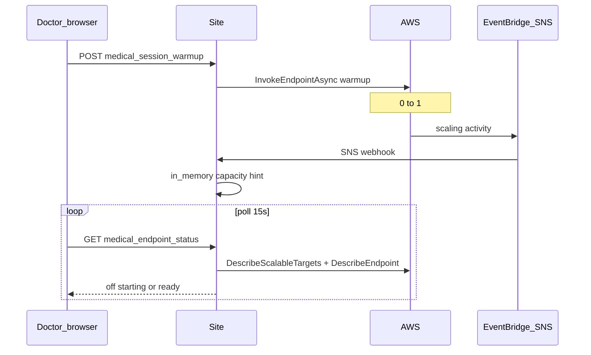

# Medical SageMaker endpoint — architecture (AWS-only)

Clinic-wide transcription GPU status comes **only from AWS**, not from a shared S3 JSON file.

## State model

| `status` | Meaning |
|----------|---------|
| `off` | `DesiredCapacity == 0`, `CurrentInstanceCount == 0`, no recent warmup request |
| `starting` | Scale-up in progress: `DesiredCapacity >= 1` but `CurrentInstanceCount == 0`, or warmup POST within grace window |
| `ready` | `CurrentInstanceCount >= 1` and SageMaker `EndpointStatus == InService` |

**Green banner:** `endpoint_ready === true` (same as `status === 'ready'`).

`POST /api/gpu_started` does **not** change this banner (still used for transcription job timing only).

## Data flow

- **SNS** → one HTTPS POST to Site → updates in-memory cache on that worker only.
- **Poll** → always calls AWS APIs (authoritative).
- **All doctors** get the **same** JSON from `GET /api/medical_endpoint_status`.

## APIs

| Method | Path | Role |
|--------|------|------|
| `GET` | `/api/medical_endpoint_status` | Clinic status (poll) |
| `POST` | `/api/medical_session_warmup` | Request scale-up / SageMaker warmup invoke |
| `POST` | `/api/aws/sns/medical_endpoint_scale` | EventBridge capacity events |

## Frontend

- Poll only for banner state (`qsApplyMedicalWarmupStatusFromServer`).
- `POST /api/medical_session_warmup` when status is `off` (or after stale `starting`).
- Optional socket events trigger an **immediate poll**, not trusted state.

## Removed

- `users/_global/medical_sagemaker_endpoint_scale.json`
- Per-clinic `warm` / `worker_ready_at` flags
- Socket-driven green from `gpu_started`

## AWS setup

See [aws-medical-endpoint-scale-webhook.md](./aws-medical-endpoint-scale-webhook.md).

## Env

- `MEDICAL_SAGEMAKER_VARIANT_NAME` — must match EventBridge `resourceId`
- `MEDICAL_WARMUP_SNS_TOPIC_ARN` — validate webhook topic
- IAM on Site: `application-autoscaling:DescribeScalableTargets`, `sagemaker:DescribeEndpoint`, invoke endpoint
