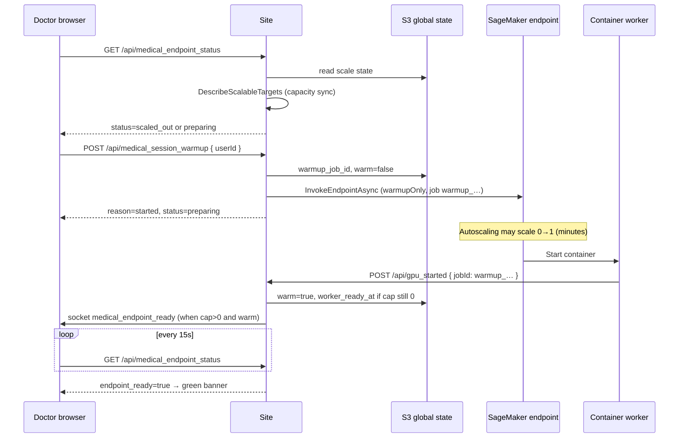
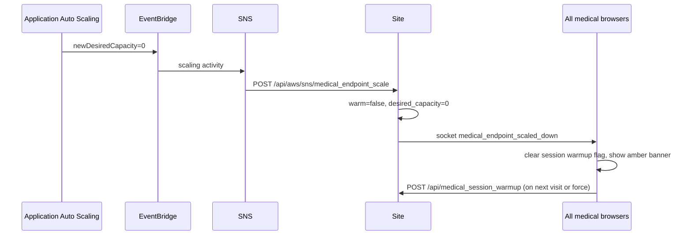

# Medical SageMaker warmup — architecture

This document describes how the **clinic-wide** medical transcription endpoint is woken, tracked, and shown in the UI. It is the source of truth for “what should happen” when debugging — not trial-and-error in logs alone.

There are **two independent axes**:

| Axis | Meaning | Who sets it |
|------|---------|-------------|
| **Capacity** | Application Auto Scaling `DesiredInstanceCount` (0 = scaled in, ≥1 = instance(s) requested) | AWS EventBridge → Site webhook, or Site poll (`DescribeScalableTargets`) |
| **Warm** | Model/container has finished session warmup and can serve transcription quickly | SageMaker worker → `POST /api/gpu_started`, or S3 async warmup output |

**Green banner (“המערכת מוכנה”)** only when both are satisfied:

```text
endpoint_ready = warm == true  AND  desired_capacity > 0
```

Until then the UI shows **preparing** (yellow) or **scaled out** (amber).

---

## Components

```text
┌─────────────────┐     HTTPS      ┌──────────────────┐
│  Medical UI     │◄──────────────►│  QuickScribe Site │
│  (app_logic.js) │   poll/socket  │  (siteapp.py)     │
└────────┬────────┘                └────────┬─────────┘
         │                                   │
         │                          S3 global state
         │                          users/_global/
         │                          medical_sagemaker_endpoint_scale.json
         │                                   │
         │                          SageMaker async invoke (warmup job)
         │                                   ▼
         │                          ┌──────────────────┐
         │                          │ SageMaker endpoint│
         │                          │ + autoscaling     │
         │                          └────────┬─────────┘
         │                                   │
         │                          gpu_started callback
         └───────────────────────────────────┘

AWS: Application Auto Scaling ──► EventBridge ──► SNS ──► POST /api/aws/sns/medical_endpoint_scale
```

- **One global record** for the whole clinic (not per doctor). Every doctor sees the same `GET /api/medical_endpoint_status`.
- **Session warmup** is triggered once per browser session when a signed-in doctor opens medical mode (`POST /api/medical_session_warmup`), unless the server is already `endpoint_ready` or a warmup is already in flight with capacity &gt; 0.

---

## Global state (S3)

**Key:** `users/_global/medical_sagemaker_endpoint_scale.json`

| Field | Role |
|-------|------|
| `warm` | `true` after successful warmup (`gpu_started` or S3 output) |
| `desired_capacity` | Last known autoscaling desired count (0, 1, …) |
| `warmup_job_id` | Current session warmup id, e.g. `warmup_1779357510_a58ea352` |
| `warmup_submitted_at` | Unix time warmup was submitted |
| `worker_ready_at` | Set when `gpu_started` arrived while AWS still reported `cap=0` (audit only; **does not** make `endpoint_ready`) |
| `sagemaker_output_uri` | S3 URI of async warmup output (optional completion path) |
| `scaled_down_at` / `warmed_at` | Timestamps for scale-in / ready |

Site keeps an in-memory cache; all Gunicorn workers read/write the same S3 object.

---

## API surface

| Method | Path | Purpose |
|--------|------|---------|
| `POST` | `/api/medical_session_warmup` | Doctor opens UI → submit SageMaker **warmup-only** async job (`warmup_*` id) |
| `GET` | `/api/medical_endpoint_status` | Poll global status (optional `userId`; response identical for all) |
| `GET` | `/api/medical_warmup_status` | Alias of endpoint status |
| `POST` | `/api/gpu_started` | SageMaker container started → mark `warm=true`, emit socket |
| `POST` | `/api/aws/sns/medical_endpoint_scale` | EventBridge/SNS capacity events → update `desired_capacity`, scale-in clears `warm` |

**Socket.IO room:** `medical_endpoint_events` (all medical clients join on connect)

| Event | When |
|-------|------|
| `medical_endpoint_ready` / `medical_warmup_ready` | `endpoint_ready` became true |
| `medical_endpoint_scaled_down` | Scale-in or capacity sync to 0 (and worker not protecting warm) |

---

## UI state machine (banner)

Server `status` drives the banner via `qsApplyMedicalWarmupStatusFromServer`:

```text
                    ┌─────────────┐
         start      │   idle      │  no job, cap unknown or >0, not warm
    ───────────────►│  (rare)     │
                    └──────┬──────┘
                           │ POST medical_session_warmup
                           ▼
                    ┌─────────────┐
              ┌────►│  preparing  │  warmup_job_id set, not endpoint_ready
              │     │  (yellow)   │  (includes cap=0 right after POST — scale-up in progress)
              │     └──────┬──────┘
              │            │ gpu_started + cap>0 (or poll sees ready)
              │            ▼
              │     ┌─────────────┐
              │     │   ready     │  endpoint_ready === true (green)
              │     └──────┬──────┘
              │            │ EventBridge scale-in OR capacity_sync cap=0
              │            ▼
              │     ┌─────────────┐
              └─────│ scaled_out  │  cap=0, no in-flight warmup (amber)
                    └─────────────┘
```

**Client rules (session):**

1. On medical login → `qsMaybeMedicalSessionWarmup()` → poll status → if not ready → `POST /api/medical_session_warmup`.
2. `sessionStorage` key `qs_medical_endpoint_warmup_submitted` (12h): avoids duplicate POST **only if** server still needs warmup (`qsMedicalServerNeedsSessionWarmup`).
3. Poll every 15s while not ready; re-POST after scale-out (clears session key).

---

## End-to-end: doctor opens the app (happy path)



**Important timing:** Right after `POST /api/medical_session_warmup`, AWS often still shows **`desired_capacity=0`** for several minutes. That is normal; UI must stay **preparing**, not **scaled out**, while `warmup_job_id` is active.

---

## End-to-end: scale-in (clinic closes / AWS scales to zero)



**Fallback:** If SNS is missed, `GET /api/medical_endpoint_status` runs `DescribeScalableTargets` at most every `MEDICAL_CAPACITY_SYNC_SEC` (default 60s) and applies the same scale-in logic.

---

## When does the server skip a new warmup?

`_submit_medical_sagemaker_session_warmup` returns without a new SageMaker invoke if:

| Reason | Meaning |
|--------|---------|
| `already_ready` | `warm=true` and `desired_capacity > 0` |
| `skipped_recent` | Same global `warmup_job_id` still preparing **and** `cap > 0` |
| `skipped_recent` (debounce) | Another POST within `MEDICAL_SESSION_WARMUP_INTERVAL_SEC` (default 600s) on this Site instance |
| `sagemaker_not_configured` | Not in medical SageMaker mode |

Use `force: true` on POST (client sends after scale-out) to bypass `already_ready` / debounce when appropriate.

**Stale warmup:** If `warmup_submitted_at` is older than `MEDICAL_WARMUP_STALE_SEC` (default 900s) without becoming ready, server may submit a **new** `warmup_*` job.

---

## `gpu_started` vs Supabase jobs

- Warmup ids are `warmup_*` — **not** rows in `jobs` table.
- `POST /api/gpu_started` for warmup still updates global S3 warm state and emits socket; DB timing merge is skipped for warmup ids.
- Log line `_merge_job_qs_trigger: no job row for runpod_job_id=warmup_…` is **expected** and harmless.

---

## Environment variables (production checklist)

| Variable | Role |
|----------|------|
| `MEDICAL_TRANSCRIPTION_ENGINE=sagemaker` | Enable SageMaker medical path |
| `SAGEMAKER_MEDICAL_ENDPOINT_NAME` | Endpoint name |
| `MEDICAL_SAGEMAKER_VARIANT_NAME` | Must match autoscaling `resourceId` variant (often `AllTraffic`) |
| `PUBLIC_BASE_URL` | Worker calls `{base}/api/gpu_started` |
| `MEDICAL_WARMUP_SNS_TOPIC_ARN` | Validate SNS webhook payloads |
| AWS creds on Site | S3 state, `InvokeEndpointAsync`, `application-autoscaling:DescribeScalableTargets` |

Webhook setup: [aws-medical-endpoint-scale-webhook.md](./aws-medical-endpoint-scale-webhook.md)

---

## Debugging map (symptom → check)

| Symptom | Check |
|---------|--------|
| No `POST /api/medical_session_warmup` in logs | Browser: `[medical] session warmup` console; `sessionStorage` key; client thinks `ready` |
| POST but no SageMaker activity | Site log `Medical session SageMaker warmup submitted` / failed; IAM; endpoint name |
| `gpu_started` but UI not green | `desired_capacity` still 0? `endpoint_ready` in JSON; variant name wrong on autoscaling |
| `medical_endpoint_ready ignored … desired_capacity=0` | Old build; ready requires cap&gt;0 now |
| Stuck “scaled out” right after login | Status API: `warmup_job_id` set? Should be `preparing` not `scaled_out` |
| Green while AWS scaled in | Stale S3 `warm`; SNS/webhook not reaching Site; capacity sync IAM |
| Only `GET medical_endpoint_status` forever | `already_ready` or `skipped_recent` with stale global state; force re-warm |

**Single debug call:**

```http
GET /api/medical_endpoint_status?userId=<uuid>
```

Inspect: `status`, `endpoint_ready`, `endpoint_desired_capacity`, `warmup_job_id`, `warm`, `worker_ready_at`, `stale`.

---

## Design intent (why it was built this way)

1. **Global clinic GPU** — one SageMaker endpoint serves all doctors; state is not per-user “ready” in S3 anymore.
2. **Real scale signal** — UI should reflect AWS scale-in, not a 45-minute TTL guess.
3. **Session warmup on open** — proactive wake before first recording; separate from per-upload transcription jobs.
4. **Strict ready** — avoid showing green when AWS has scaled to zero, even if a worker callback was late or state was stale.

Related code: `siteapp.py` (`_medical_*`, routes above), `static/js/app_logic.js` (`qsMaybeMedicalSessionWarmup*`, `qsApplyMedicalWarmupStatusFromServer`).
